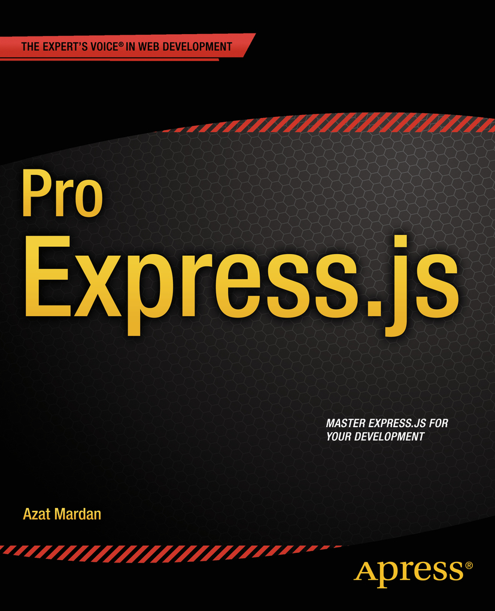
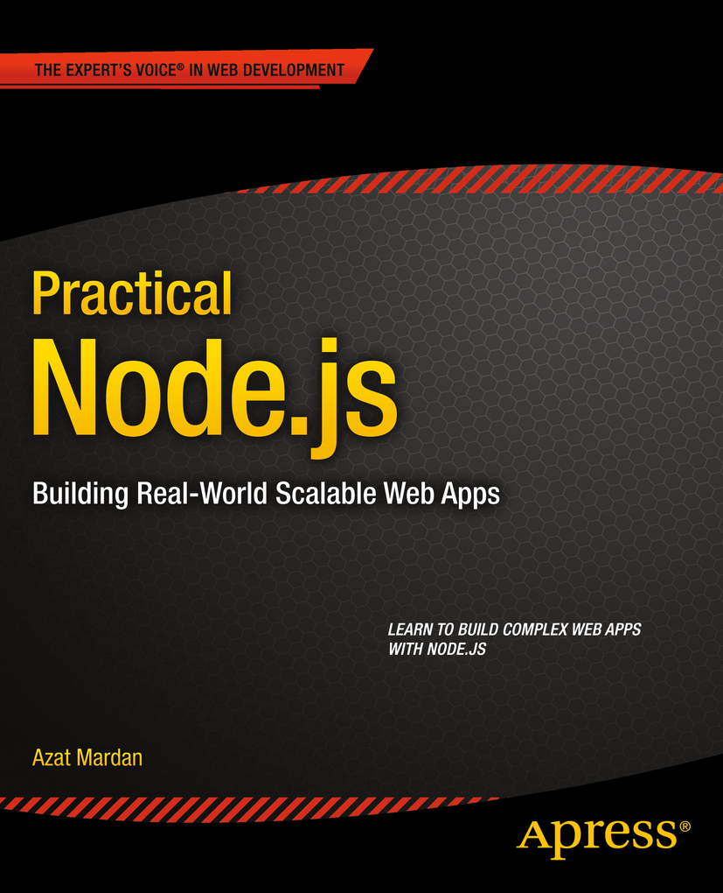
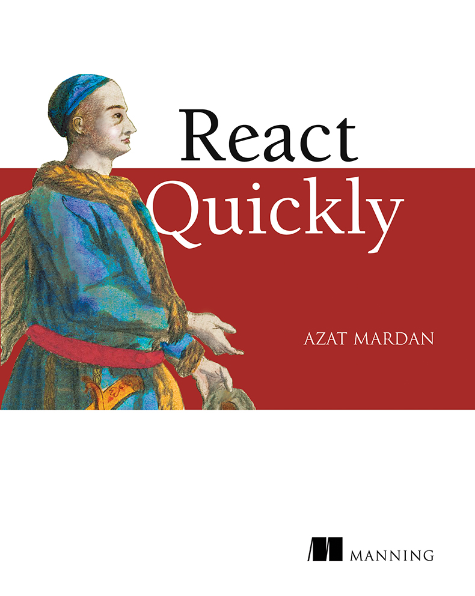
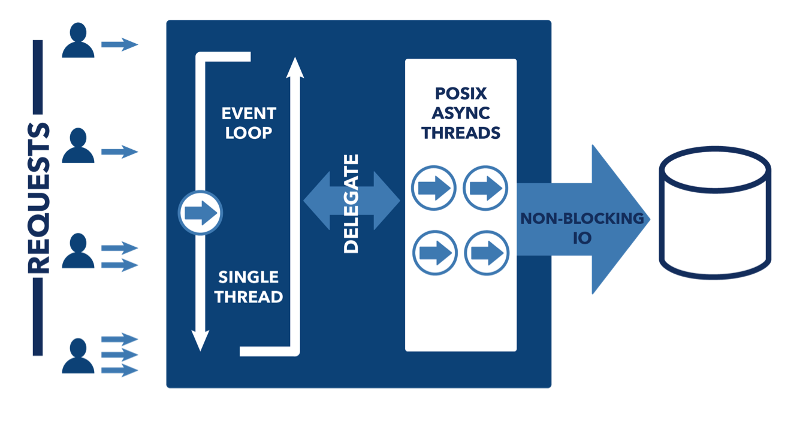

footer: © Node Program, 2016
slidenumbers: true

# Node Program
## Introduction


Node.js version: 5.1
Last updated: Jan 2016

---

### Before We Start...

You'll need:

* Node.js and npm
* Code editor
* Command line
* Internet connection
* Slides & sample code

---

### Slides and Everything Else

<https://github.com/azat-co/node-react>

```
git clone git@github.com:azat-co/node-react.git
```


---

### Installing Node.js

* [http://nodejs.org](nodejs.org)
* `$ brew install node`
* [Node in 30s](https://gist.github.com/isaacs/579814)

^If you haven't install node, this is the time.

---

You may also want/need a local data store!

* [MongoDB](https://www.mongodb.org/downloads)
* [MySQL](http://www.mysql.com/downloads)
* [Postgresql](http://www.postgresql.org)

^Provide links to PDFs and code

---

### Introductions


Instructor: Azat Mardan

* Work: Capital One, Storify, FDIC, NIH, DocuSign
* Books: ReactQuickly, Full Stack JavaScript, Practical Node.js, Pro Express.js, Mongoose Course

^Tell about yourself and find out about them

---





---





---


### Introduce Yourself

1. What is your tech background/language?
1. What is your project?
1. How do you plan to use Node.js?

---

### Outcome

* Build server-side web applications with the Node.js platform utilizing the JavaScript language
* Use Node.js framework Express.js
* Use NoSQL database MongoDB
* Get familiar with Meteor
* Grasp React and Isomorphic JavaScript

^Upon successful completion of this training, participants will be able to do following


---

### HipChat Room


<https://www.hipchat.com/gI1lG5c2q>

---

# Introduction

---


### Why Server-Side JavaScript?

> *Node was originally born out of this problem — how can you handle two things at the same time*
-- Ryan Dahl, The Creator of Node.js

---

## Why Server-Side JavaScript?

* Non-blocking I/O: performant
* Fast: browser arms race (V8)
* **One language across the stack**
* Expressive: don't waste time on setup
* Solid standard (ECMA)

---

### Advantages of Node.js

* Non-blocking I/O
* Super fast (V8)
* Vibrant ecosystem (npm)
* Ability to re-use code on browser and server
* Ability to use front-end devs for back-end and vice versa

^The Event loop is the core of Node.js and it's a genius idea. But: Don't use Node.js for blocking, CPU-intensive tasks. Node.js is not suited for stuff like that. Node.js is suited for I/O stuff (like web servers).

---

## Non-blocking I/O


---

It's kind of a big deal


---

### Disadvantages of Node.js

* Devs have to think in async and functional+prototypal
* Frameworks and tools are not as mature as in Ruby, Java, Python (yet)
* JavaScript "quirks" (mostly fixed in ES6!)

^This is the reason why Node.JS is called Node.JS. JavaScript has been designed in ~10 days and that's partly obvious. There are some obvious drawbacks. Prototypal instantiation wasn't originally planned to be integrated. Prototypes are much more elegant, but since Netscape wanted to jump onto the Java-train, they introduced the "new" keyword. So there's a very hybrid notion to a lot of the language itself. Once the language, module and tooling learned, it's as powerful or more so than any other with powerful constructs to implement OOP like or similar to immutable functional languages.

---

### Node Gotcha

Don't use Node.js for CPU-intensive tasks. Hand them over to other workers.

^Node.js certainly has some disadvantages, but it is currently one of the best tools out there in order to create asynchronous, non-blocking apps.

---

### Downsides of JavaScript (Not only Node)

* Callback Hell
* Prototypal inheritance

^Generators, promises, async  
Class or functional inheritance
^ ES6 will fix a lot of them

---

### JavaScript is Optional in Node.js

It's **possible** to use other languages for Node.js that compile into JavaScript, e.g., CoffeeScript, TypeScript, and ClosureScript.

^JS will still run under the hood.

---


---

### Node is Single-Threaded

Node.js is single-threaded by design to make asynchronous processing simpler. Multi-threading can be very complex: racing condition, deadlocks, priority inversions...

It turned out for web-based application, single-threaded asynchronous event-loop based non-blocking I/O is very performant!


---


---



---

### Scaling Node Vertically

To scale Node vertically, you can take advantage of multiple CPUs cores or compute units (multi-threading) with clustering (e.g., StrongLoop's PM).

The idea is to have multiple processes from the same code base to listen on the same port for requests.

---

### Integration

* noSQL
* SQL
* OAuth 1.0/2.0
* REST
* SOAP

^Discuss how Node.js integrates with existing databases (mySQL, Postgresql, Oracle, MS SQL, etc) and is able to easily integrate with a host of other solutions that currently exist in enterprise environments.
This is a good opportunity to reach out to the class and inquire what they use in their respective environments.

---

### Databases

* mySQL
* Postgresql
* Oracle
* MS SQL
* MongoDB
* Cassandra

^Node works with these

---

### Node + Client MVC Architecture

Single-Page Applications a.k.a. BYOC: REST API in Node + SPA

* Backbone
* Angular (e.g., M.E.A.N)
* Ember
* React
* MV*

^Bring Your Own Client

---

### Server-side Rendering

* Jade
* Handlebars
* EJS
* Hogan

Many more: http://garann.github.io/template-chooser

---

### Node for SOA / REST


^Better scalling, faster non-blocking req-response

---

# So what is ECMAScript?

^Node.js is often written in JavaScript (but not always) or to be more specific with ECMAScript.

---

### ES as a Language Specification

* Browser implementations (like Chrome's V8)
* Node builds on V8 with C++

---

### Browser JS != Node

* Modules
* Scopes
* window vs. global and process
* `fs` and other modules

---

### Node Core: V8, libev, and libeio

* Libev: The event loop
* LibEio: Async I/O
* LibUv: Abstraction on libEio, libev, c-ares (for DNS) & iocp (for Windows)

^It's written originally for `*`nix systems. Libev provides a simple yet optimized event loop for the process to run on. You can read more about libev here.  
It handles file descriptors, data handlers, sockets etc. You can read more about it here here.  
LibUv performs, mantains and manages all the io and events in the event pool. ( in case of libeio threadpool ). You should check out Ryan Dahl's tutorial on libUv. That will start making more sense to you about how libUv works itself and then you will understand how node.js works on the top of libuv and v8.

---

### Node Core Architecture


---

### Patterns evolve to serve market needs


---

### Framework Categories

* KISS Servers: small core, small modules
* Convention: follow the leader, steep learning curve
* Configuration: open path, manual effort for advanced
* ORM & Isomorphic: model-driven, shared code, steep learning

---

### Framework Examples

* KISS Servers: Node core
* Convention: Express, Restify, Total.js
* Configuration: Hapi, Kraken
* ORM & Isomorphic: LoopBack, Sails, Meteor*

^Kraken (not a real framework) actually builds an Express app using config files  
Meteor is the only framework here that actually uses the same JS files on both sides

---

## Node Program

---

# Effective Learning

## 50% workshops +
## 50% lectures +
## 50% Q&A/office hours
(yes, we deliver 150%!)

---

workshops = coding + collaboration + pair programming + solo programming + discussions + reading + solving problems (✋ if stuck)

---

# Interweaving

---

# Spaced Repetition

---

### Agenda

Node.js Day:

* 9-11:00: Lectures: Intro, setup and Node.js Basics
* 11:00-12:00: Workshop
* 12:00-1:00: Lunch

---

### Agenda

Node.js Day:

* 1:00-2:00 Lectures: MongoDB, Express
* 2:00-3:00: Workshop
* 3:00-3:15 Break
* 3:15-4 Lectures: Meteor
* 4-5 Workshop

---

### Agenda

React Day:

* 9-11: Lectures
* 11-12: Workshop
* 12-1: Lunch

---

### Agenda

React Day:

* 1-2: Lectures
* 2-3: Workshop
* 3-5: Office hours and individual tracks

---

## Individual Tracks

1. Deployment
2. Single-page Application
3. REST API
4. Your own project/idea

---

## Questions and Exercises

Write them down and ask at the end of the lesson:
you'll have 5 open frames to ask questions. Use them fully!

:+1:


No workshop for this lesson. 😁

---
