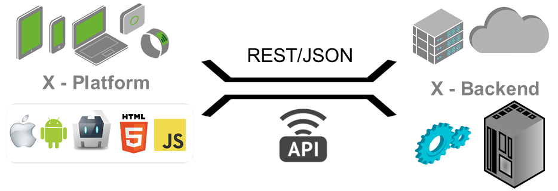

footer: © Node Program, 2018
slidenumbers: true
theme: Merriweather, 8
build-lists: true


# NodeProgram.com and Node.University
## Node Basics


---

# Node.js

---

# Introduction

---


### Why Server-Side JavaScript?

> *Node was originally born out of this problem — how can you handle two things at the same time*
-- Ryan Dahl, The Creator of Node.js

---

## Why Server-Side JavaScript?

* Non-blocking I/O: performant
* Fast: browser arms race (V8)
* **One language across the stack**
* Expressive: don't waste time on setup
* Solid standard (ECMA)

---

### Advantages of Node.js

* Non-blocking I/O
* Super fast (V8)
* Vibrant ecosystem (npm)
* Ability to re-use code on browser and server
* Ability to use front-end devs for back-end and vice versa

^The Event loop is the core of Node.js and it's a genius idea. But: Don't use Node.js for blocking, CPU-intensive tasks. Node.js is not suited for stuff like that. Node.js is suited for I/O stuff (like web servers).

---

## Non-blocking I/O

---

It's kind of a big deal


---

### Disadvantages of Node.js

* Devs have to think in async and functional+prototypal
* Frameworks and tools are not as mature as in Ruby, Java, Python (yet)
* JavaScript "quirks" (mostly fixed in ES6!)

^This is the reason why Node.JS is called Node.JS. JavaScript has been designed in ~10 days and that's partly obvious. There are some obvious drawbacks. Prototypal instantiation wasn't originally planned to be integrated. Prototypes are much more elegant, but since Netscape wanted to jump onto the Java-train, they introduced the "new" keyword. So there's a very hybrid notion to a lot of the language itself. Once the language, module and tooling learned, it's as powerful or more so than any other with powerful constructs to implement OOP like or similar to immutable functional languages.

---

### Node Gotcha

Don't use Node.js for CPU-intensive tasks. Hand them over to other workers.

^Node.js certainly has some disadvantages, but it is currently one of the best tools out there in order to create asynchronous, non-blocking apps.

---

### Downsides of JavaScript (Not only Node)

* Callback Hell
* Prototypal inheritance

^Generators, promises, async
Class or functional inheritance
^ ES6 will fix a lot of them

---

### JavaScript is Optional in Node.js

It's **possible** to use other languages for Node.js that compile into JavaScript, e.g., CoffeeScript, TypeScript, and ClojureScript.

^JS will still run under the hood.

---


---

### Node is Single-Threaded

Node.js is single-threaded by design to make asynchronous processing simpler. Multi-threading can be very complex: racing condition, deadlocks, priority inversions...

It turned out for web-based application, single-threaded asynchronous event-loop based non-blocking I/O is very performant!


---


---


---


---


---


### Integration

* noSQL
* SQL
* OAuth 1.0/2.0
* REST
* SOAP

^Discuss how Node.js integrates with existing databases (mySQL, Postgresql, Oracle, MS SQL, etc) and is able to easily integrate with a host of other solutions that currently exist in enterprise environments.
This is a good opportunity to reach out to the class and inquire what they use in their respective environments.

---

### Databases

* mySQL
* PostgreSQL
* Oracle
* MS SQL
* MongoDB
* Cassandra

^Node works with these

---

### Node + Client MVC Architecture

Single-Page Applications a.k.a. BYOC: REST API in Node + SPA

* Backbone
* Angular (e.g., M.E.A.N)
* Ember
* React
* MV*

^Bring Your Own Client

---

### Server-side Rendering

* Jade
* Handlebars
* EJS
* Hogan

Many more: http://garann.github.io/template-chooser

---

### Node for SOA / REST



^Better scalling, faster non-blocking req-response

---

# So what is ECMAScript?

^Node.js is often written in JavaScript (but not always) or to be more specific with ECMAScript.

---

### ES as a Language Specification

* Browser implementations (like Chrome's V8)
* Node builds on V8 with C++


---

Disclaimer: This is NOT a course on JavaScript. Please invest a few days in learning its fundamentals:

* Eloquent JavaScript
* JavaScript The Good Parts
* ES6
* JavaScript Ninja
* Functional JavaScript

---

# ES6 Sidenote

* Destructuring
* Const and let
* Functions
* Interpolations

More: [Top 10 ES6 Features Every Busy JavaScript Developer Must Know](https://webapplog.com/es6)

---

# Demo

`code/node/lang`


---

### Browser JS != Node

* Modules
* Scopes
* window vs. global and process
* `fs` and other modules

---

### Node Core: V8, libev, and libeio

* Libev: The event loop
* LibEio: Async I/O
* LibUv: Abstraction on libEio, libev, c-ares (for DNS) & iocp (for Windows)

^It's written originally for `*`nix systems. Libev provides a simple yet optimized event loop for the process to run on. You can read more about libev here.
It handles file descriptors, data handlers, sockets etc. You can read more about it here here.
LibUv performs, mantains and manages all the io and events in the event pool. ( in case of libeio threadpool ). You should check out Ryan Dahl's tutorial on libUv. That will start making more sense to you about how libUv works itself and then you will understand how node.js works on the top of libuv and v8.

---

### Node Core Architecture


---

### Patterns evolve to serve market needs


---

### Framework Categories

* KISS Servers: small core, small modules
* Convention: follow the leader, steep learning curve
* Configuration: open path, manual effort for advanced
* ORM & Isomorphic: model-driven, shared code, steep learning

---

### Framework Examples

* KISS Servers: Node core
* Convention: Restify, Total.js
* Configuration: Hapi, Kraken, Express
* ORM & Isomorphic: LoopBack, Sails, Meteor*

^Kraken (not a real framework) actually builds an Express app using config files
Meteor is the only framework here that actually uses the same JS files on both sides

---


> "Everything is a callback...  in Node everything is non-blocking and so it doesn't allow you to just sit there and then return the response. "
-- Ryan Dahl <http://www.infoq.com/interviews/node-ryan-dahl>


^Discuss the basic server in node.js, how the request and response work, what libraries they're from and then dive into code.

---

### Node Language

Node is not JavaScript, but both JavaScript and Node are ECMAScript.

^There are discrepancies between browser JS and Node.

---

# Demo

Ways to run Node:

1. Node REPL
2. Node Eval (`node -e`)
3. Node Command
4. Other tools and scripts, e.g., bash script, Makefile, nodemon, node-dev, superviser, pm2, etc.

---

### `global` Object

The global object is similar to window object in the browser JavaScript.


`global.process` same as `process`
`global.console` same as `console`
`global.require` same as `require`
`global.module.exports` same as `module.exports`


---

### `process` Object

In Node, interaction with the current Node process takes place
via the `process` object.

---

### Environment Variables

Environment variables can be accessed via the `env` attribute:

```js
console.log(process.env)

{ SHELL: '/bin/bash',
  USER: 'jordan',
  HOME: '/home/jordan',
  ...
}
```

---

### Command-Line Arguments

Shell commands accept arguments to alter their behavior:

```
$ echo "Hello World!" // "Hello World" is the argument here
```

Node makes these arguments accessible via `process.argv`

---

### Command-Line Options

The `argv` property is an array.

The first two elements are 'node' and the application's name:

```
$ node app.js arg1 arg2 arg3=val3

/*
process.argv => [
  'node', 'app.js', 'arg1',
  'arg2', 'arg3=val3'
]
*/
```

---

### Exiting a Process

To exit a process, use the `exit` function

```js
process.exit()
```

---

### Exiting with Errors

Exit codes can also be specified

```js
// this process exits successfully
process.exit(0)

// this process failed
process.exit(1)

// this process failed with a different code
process.exit(129)
```

---

### Exiting with Errors

Note:

* Different failure codes can be used to differentiate types of
failure
* Knowing how an application failed allows the developers the means
to program an appropriate response

---

# Modules

---

### Modules in Browser

Don't exist natively until ES6, i.e., no built-in module support!

---

### Modules in Browser Workarounds

* `<script>`
* CommonJS
* AMD (requirejs)
* ES6

---

### Module Loaders in Browser

* SystemJS
* RequireJS
* Browserify
* es6-module-loader

More info: <http://mzl.la/1Ieu8zM> and <http://mzl.la/1Ieu7vz>

---

### Modules in Node

Built-in modules with `require` a CommonJS notatioin! :gift_heart:

Node Require Example:

```js
var express = require('express')
var app = express()
```

^Contract Specification for modules
Module Context:
In a module, there is a free variable "require", that is a function.
The "require" function accepts a module identifier.
"require" returns the exported API of the foreign module.
If there is a dependency cycle, the foreign module may not have finished executing at the time it is required by one of its transitive dependencies; in this case, the object returned by "require" must contain at least the exports that the foreign module has prepared before the call to require that led to the current module's execution.
If the requested module cannot be returned, "require" must throw an error.
In a module, there is a free variable called "exports", that is an object that the module may add its API to as it executes.
modules must use the "exports" object as the only means of exporting.

---

### Requiring Modules

Modules can live different places with JavaScript. They can be on local machines, virtual machines, servers, remote URI locations, or anywhere really.

---

### Loading Node Modules

These modules can be loaded with module loaders like require or via inversion of control patterns.

```js
var filesystem = require('fs'),
  databaseConfigs = require('./configs/database.json'),
  routes = require('../routes'),
  server = require('./boot/server.js')
```

^A module identifier is a String of "terms" delimited by forward slashes.
A term must be a camelCase identifier, ".", or "..".
Module identifiers may not have file-name extensions like ".js".
Module identifiers may be "relative" or "top-level". A module identifier is "relative" if the first term is "." or "..".
Top-level identifiers are resolved off the conceptual module name space root.
Relative identifiers are resolved relative to the identifier of the module in which "require" is written and called.
Whether a PATH is supported by the module loader for resolving module identifiers.

---

### Creating a Module with a "Class" Example:

```js
function UserController() {
  var username, password
  function doLogin(user, pw) {
    username = user;
    password = pw
    // do the rest of the login work
  }
  var publicAPI = {
    login: doLogin
  }
  return publicAPI
}
// create a `UserController` instance
var ctrl = UserController()
ctrl.login( "fred", "12Battery34!" )
```

---

### Node Patterns for Module Exports

* `module.exports = function(ops) {...}`
* `module.exports = {...}`
* `exports.methodA = function(ops) {...}`
* `exports.obj = {...}`

---

### Function Pattern

`module.js`:

```js
module.exports = function(options) {
  var limit = 100
  if (options.type === 'foobar') {
    limit = 200;
  }
  return {
    name: 'request',
    limit: limit,
    type: options.type,
    method: function(data) { return data; }
  }
}
```

^Provides constructor/init function - more versatile.

---

### Functional Pattern

`main.js`:

```js
var mod = require('./module.js')
var request = mod({
  type:'foobar'
})
request.method({
  x: 10,
  y: 20
})
```

---

## Demo

* `code/node/module-basic`
* `code/node/module-greetings` v2 and v3

^Also reference the `increment.js`, `math.js`, and `05-modules-basic.js` files to provide another discussion point and example of how to build modules.
Walk through the steps in the following files.  (be sure to mirror your display to make it easier)

---

## Observer Pattern

```js
var Job = function() {}
require('util').inherits(Job, require('events').EventEmitter)
job = new Job()

job.on('done', function(timeDone){
  console.log('Job was pronounced done at', timeDone)
})

job.emit('done', new Date())
job.removeAllListeners()
```

---

# npm

---

### Meet the beast!


^Discuss what NPM is, the capabilities it adds. Lecture on how it can also be used for much more than merely the repository of where libraries are but also a deployment tool, how the package.json file comes into place and more.

---

### What is npm?

A package manager for Node.

* Website: <https://www.npmjs.com/>
* Command-line tool: `npm`
* Registries: public and private

---

### Introduction to NPM

Two ways to install a module:

* Locally: most of your projects' dependencies, e.g., `express`, `request`, `hapi`

  `npm install module-name`

* Globally: command-line tools only (mostly), e.g., `mocha`, `grunt`, `slc`

  `npm install -g module-name`

^(Some frameworks offer CLI, but most of them mainly belong into 1. category-don't try to install `express` with `-g`!)
node_modules is your friend— no conflicts unlike Ruby, Python... because each dep. has nested dependincies

---

### Installing packages

```bash
$ npm install express
$ npm install express@4.2.0
$ npm install express@latest
$ npm install express --save
$ npm install mocha --save-dev
$ npm install grunt -g
$ sudo npm install grunt -g
```

^Ways to install locally
--save (and --save-dev) saves into package.json
Discuss semantic versioning!

---

### Package.json

Creating package.json: Run init action to interactively create a package.json

```
$ npm init

This utility will walk you through creating a package.json
file.  It only covers the most common items, and tries to
guess sane defaults.

See `npm help json` for definitive documentation on these
fields and exactly what they do.

Use `npm install <pkg> --save` afterwards to install a package
and save it as a dependency in the package.json file

Press ^C at any time to quit
name: (my-package-name)
```

---

### Package.json

```js
{
  "name": "my-cool-app",
  "version": "0.1.0",
  "description": "A gret new application",
  "main": "server.js",
  "dependencies": {
    "express": "~4.2.0",
    "ws": "~0.4.25"
  },
  "devDependencies": {
    "grunt": "~0.4.0"
  }
}
```

^Package.json is required for npm modules

---

### npm

When running `npm install NAME` in a folder:

* nmp looks for node_modules or package.json
* if nothing is found it goes up the tree

Therefore, in an empty folder, create package.json or node_modules dir first.

---

## Demo :computer:

Sample Code:

`code/node/11-npm-cli.txt`

^Step through installing some libraries and setting up a project with npm init


---

### Public Modules & Registries

Set config values...

```
$ npm set init.author.name "Your Name"
$ npm set init.author.email "you@example.com"
$ npm set init.author.url "http://yourblog.com"
```

Sign up on the npm website and add yourself:

```
$ npm adduser
```

---

### Publishing your module

Add `package.json` (maybe try `npm init`)

Then Publish!

```
$ cd my-cool-app
$ npm publish
```

---

### Private Registries

* Hosted by npmjs
* Hosted by you

^Discuss the differences between npmjs.org and enterprise private repositories. Elaborate on how internal can be used and mixed with the public repository.

---

Advantages of private:

Code is not exposed to outside and no external dependencies (if self-hosted)

(There are strategies for deployment, e.g., tar file)

---

To list currently installed npm modules, use the ls action
ls lists out modules local to the current Node project

```bash
$ npm ls
/home/johndoe/node-app
|__ q@1.0.1
```

To list globally installed modules, add the -g flag

```bash
$ npm ls -g
/usr/lib
|__ bower@1.3.11
  |__ abbrev@1.0.5
  |__ archy@0.0.2
|__ semver@4.0.0
```

---

### Remove a module

To remove an npm module

```
$ npm rm mysql
```

To remove a global module

```
$ npm rm mysql -g
```

---

### Packaging

Module packaging in Node is done using a `package.json` file
There are many options that can be configured:

* name
* version number
* dependencies
* etc

---

### Private Modules

The private attribute prevents accidental publishing

```js
{
    "name" : "my-private-module",
    "version": "0.0.1",
    ...
    "private": true,
    ...
}
```

---

## When to use `-g`?

A: Only for command-line tools. They usually have `bin` in package.json:

```js
{
  "name": "stream-adventure",
  "version": "4.0.4",
  "description": "an educational stream adventure",
  "bin": {
    "stream-adventure": "bin/cmd.js"
  },
  "dependencies": {
    ...
```

---

# Hello World

---

### Web Content

Types of web content

* Static
* Dynamic

^This content is here to dive deeper into what to build with and how to build Node.js apps from a rudimentary level.

---

### Node is mostly for Dynamic content

---

### The server, request, response objects

```js
var http = require('http');

http.createServer(function (req, res) {
  res.writeHead(200, {'Content-Type': 'text/plain'})
  res.end('Hello World\n')
}).listen(1337, '127.0.0.1')

console.log('Server running at http://127.0.0.1:1337/')
```

^createServer callback is called each time there's a request
no nmp modules in this example

---

### Running the App

Run with:

```
$ node server.js
```

Send requests:

```
$ curl http://localhost:1337
```

Or

<http://localhost:1337>

---

### HTTP Object

Http object:

<https://nodejs.org/api/http.html>
<https://nodejs.org/api/http.html#http_class_http_server>

```js
var server = http.createServer([requestListener])
server.listen(port[, hostname][, backlog][, callback])
```

---

### HTTP Response

```js
response.writeHead(200, {
  'Content-Length': body.length,
  'Content-Type': 'text/plain' })
```

---

## Demo

Sample Code (`code/node`):

1. `code/node/08-nodejs-app.js`
1. `code/node/09-nodejs-app2.js`
1. `code/node/static-app-project`

---

# Testing

 assert:

```js
const assert = require ('assert')
```

---

# Chai Should

```
const should = require('chai').should()
```

`code/node/escape.test.js`

---

## Starting learnyounode

Install:

```
$ sudo npm install learnyounode -g
```

---

Start:

```
$ learnyounode
```

---

## Verifying `learnyounode`

Verify solution with:

```
$ learnyounode verify program.js
```

---

## `learnyounode` Workshop

1. Pick the first problem
2. Read instructions
3. Solve the problem (e.g., create `program.js`)
4. Verify
5. Pick the next problem
